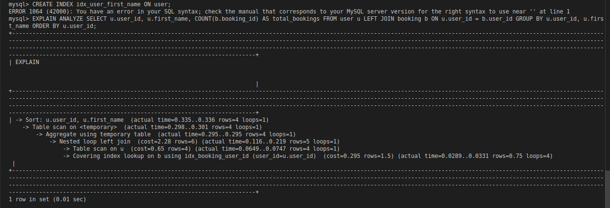
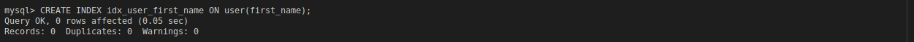
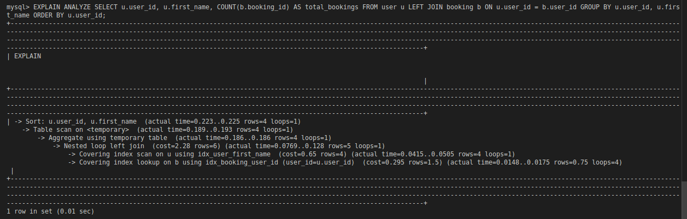

# Index Performance

This document summarizes the impact of adding indexes to commonly used columns in the Airbnb Clone database.

## Indexes Added

Based on the analysis in [`database_index.sql`](./database_index.sql), the following indexes were created:

- **User Table**

  - `user_id`: Primary key (index created automatically)
  - `first_name`: Custom index created
    ```sql
    CREATE INDEX idx_user_first_name ON user(first_name);
    ```

- **Booking Table**

  - `booking_id`: Primary key (index created automatically)

- **Property Table**
  - `property_id`: Primary key (index created automatically)
  - `name`: Custom index created
    ```sql
    CREATE INDEX idx_property_name ON property(name);
    ```

## Performance Impact

Adding indexes to frequently queried columns significantly improved query performance, especially for searches and joins involving `user.first_name` and `property.name`.

### Performance Evidence

See the images below for a visual comparison:

- **Before Indexing:**
  

- **Creating Indexes:**
  

- **After Indexing:**
  

The images demonstrate reduced query execution time and improved efficiency after indexes were applied.

---

Indexes are a crucial optimization for large datasets and should be chosen based on query patterns and workload.
